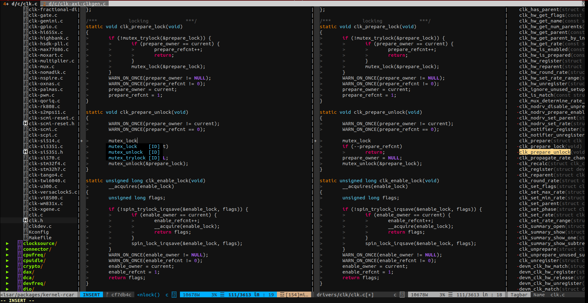

## Short description

### Required

Use neovim !
```
sudo apt-get install neovim
```

Other dependencies
```
sudo apt-get install ruby-dev cscope
```

### Install

1) Install vim and dependencies
```
# Clone the repository somewhere to keep it
git clone https://github.com/edelangh/vimrc

# Install [vim-plug](https://github.com/junegunn/vim-plug) !
curl -fLo $HOME/.local/share/nvim/site/autoload/plug.vim --create-dirs \
    https://raw.githubusercontent.com/junegunn/vim-plug/master/plug.vim

# Install the different neovim language extension
gem install --user-install neovim

# Use it as your default vim configuration
mkdir -p $HOME/.config/nvim
ln -s $(path_repo)/.vimrc $HOME/.config/nvim/init.vim

```

2) Install plugins
```
vim +PlugInstall +qall
vim +PlugUpdate +qall
```

3) Install fonts
```
cd /tmp
git clone https://github.com/ryanoasis/nerd-fonts --depth=1
cd nerd-fonts
./install.sh Ubuntu
cd ..
rm -rf nerd-fonts
```

4) Enjoy !
```
vim
```
### Important Shotcuts

 - \<Leader\>+h+u: (gitgutter) git undo
 - Ctrp+p:       (CtrlP) Search file in all subdirs
 - Ctrl+\\+d:    (Cscope) Search definition of current word
 - Ctrl+o:       Open a terminal
 - Ctrl+f:       Focus current file in filetree

## Screenshot


